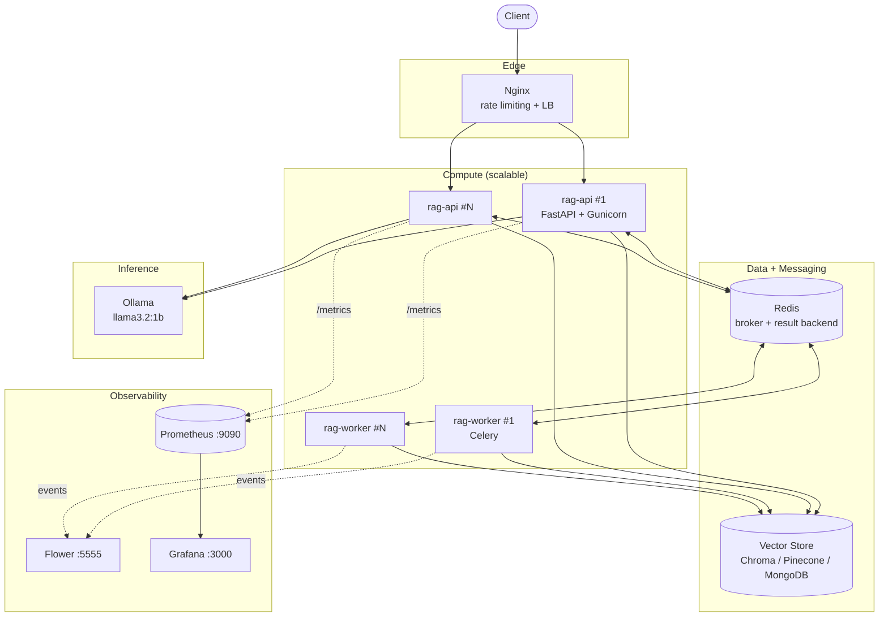
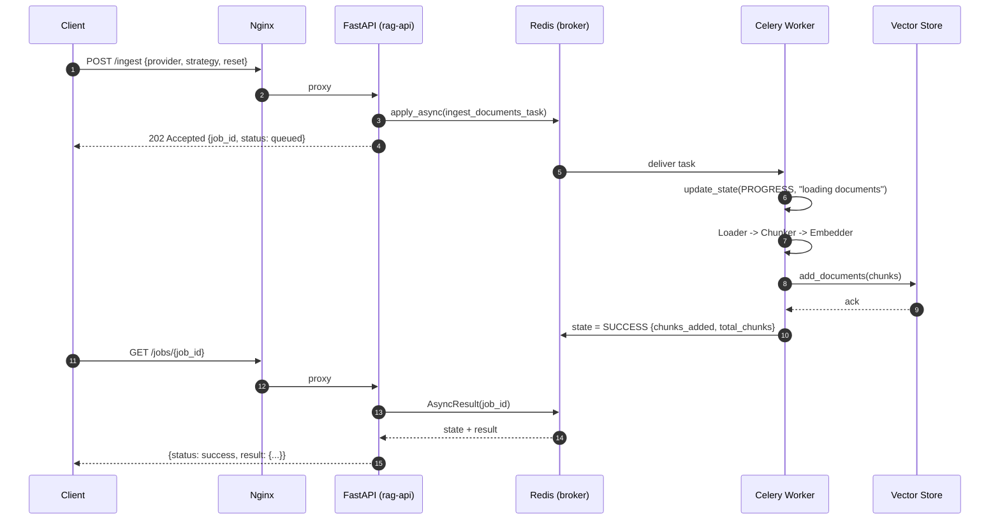
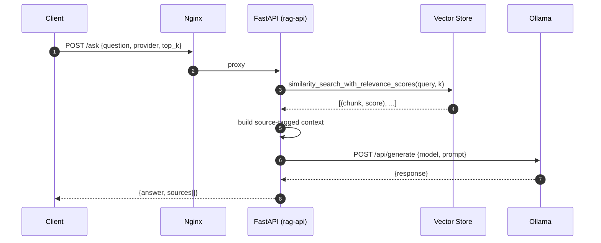
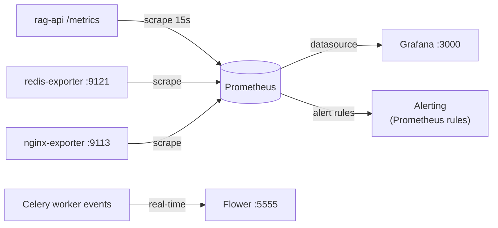
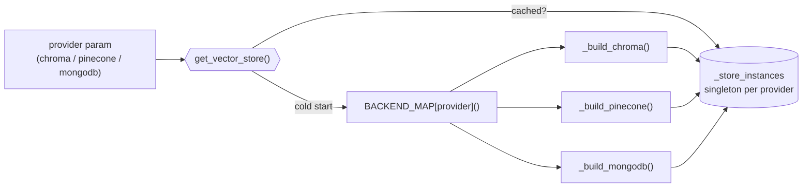
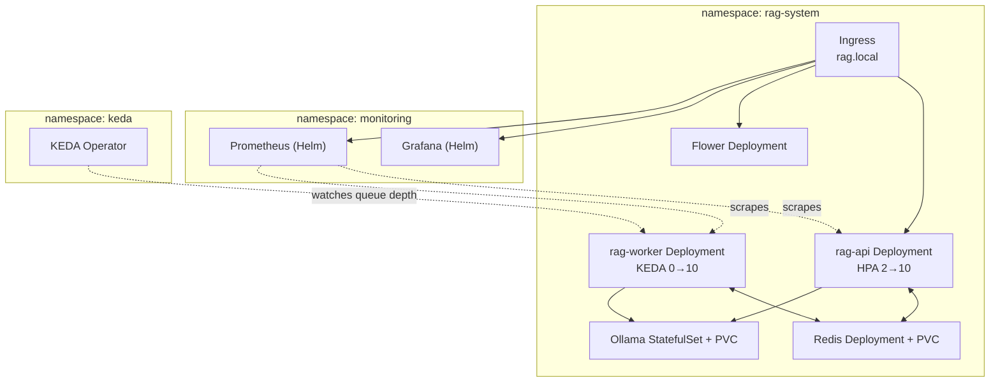

# Architecture Diagrams

Visual reference for the two request flows, the monitoring pipeline, and
the full system topology. Diagrams render natively from the Markdown
source below — no external image assets to keep in sync.

---

## System topology

---

## Ingestion flow (async)

Ingestion never blocks the HTTP thread — `POST /ingest` and `POST /upload`
both hand off to Celery and return immediately with a `job_id`.

**Failure path:** if the task raises, the worker retries up to 2 times
with exponential backoff (`2^n` seconds). A `SoftTimeLimitExceeded`
(10 minutes) is treated as terminal and marks the job `failed` immediately
rather than retrying — see `src/worker/tasks.py`.

---

## Query flow (sync)

`POST /ask` is synchronous end-to-end — the client waits for retrieval
and generation to complete in one request.

**Failure path:** if Ollama is unreachable or times out, `Generator.generate()`
catches the error and returns a plain-text error message as the `answer`
field — the HTTP response is still `200 OK` with valid JSON, so callers
must check the *content* of `answer`, not just the status code.

---

## Monitoring flow

---

## Vector store factory

The pipeline code never imports a backend-specific client — `get_vector_store()`
resolves and caches one instance per provider, so `chroma`, `pinecone`, and
`mongodb` are switchable per-request with identical calling code.

Note: MongoDB's client is constructed lazily on first use, not at module
import — this keeps `chroma`-only deployments from requiring a
`MONGODB_ATLAS_URI` just to boot.

---

## Kubernetes topology (Minikube)

